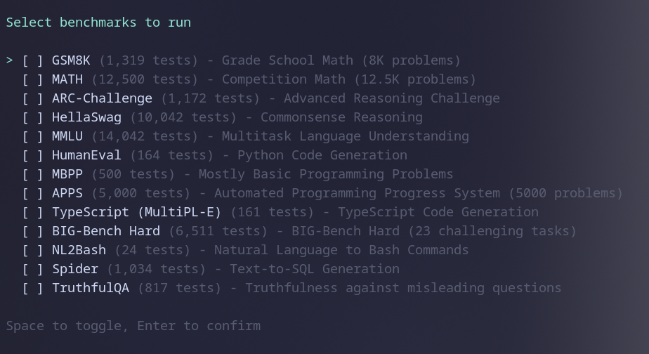
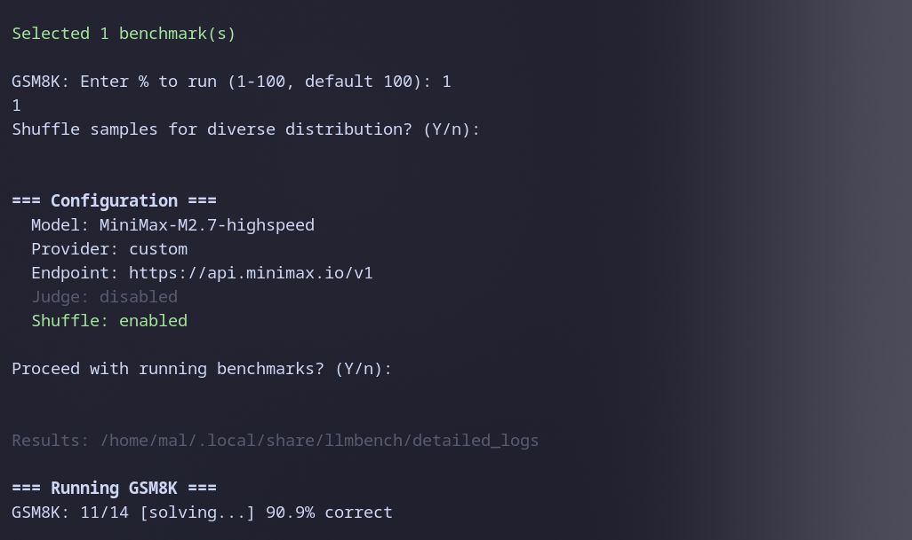
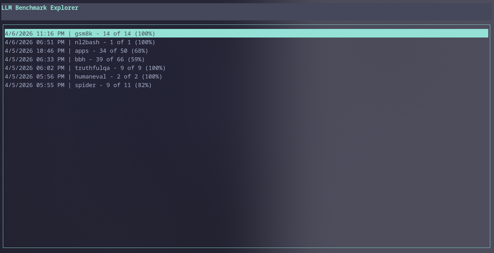
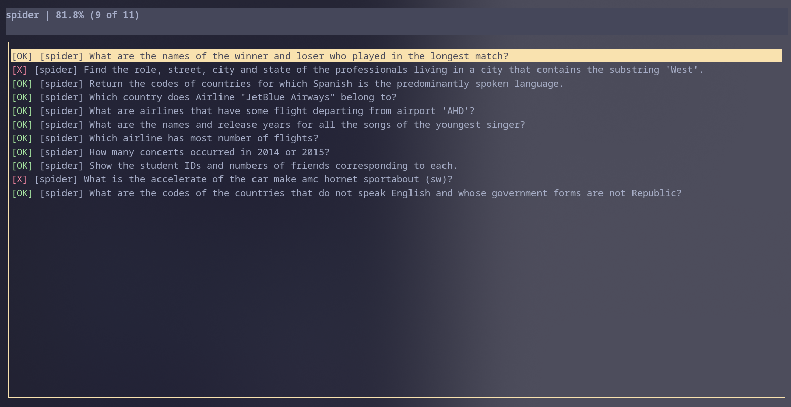
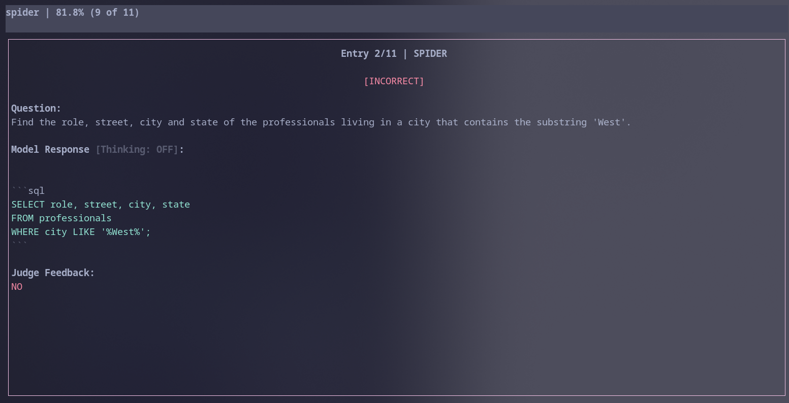

# llmtester

An interactive CLI tool for benchmarking LLMs across multiple benchmarks. Run via `npx` without installing.

## Features

- **Interactive CLI** - Keyboard-driven benchmark selection and configuration
- **Multi-Provider Support** - OpenAI, Anthropic, Together.ai, Groq, Fireworks AI, Perplexity, OpenRouter, and any OpenAI-compatible API
- **LLM-as-Judge** - Optional secondary model evaluation for code, math, SQL, bash, and truthfulness benchmarks
- **Progress Tracking** - Resume interrupted evaluations from where you left off
- **Result Explorer** - Built-in TUI to browse past results, filter by pass/fail, and inspect individual responses
- **Config Persistence** - Saves provider, endpoint, and model settings between runs
- **Shuffle & Sampling** - Run a percentage of each benchmark with optional shuffling for diverse distribution

## Screenshots

**Select benchmarks to run**


**Progress during benchmark run**


**Browse past benchmark runs**


**Run a specific benchmark**


**Inspect individual test results**


## Supported Benchmarks

| Benchmark | Tests | Description | Judge |
|-----------|-------|-------------|-------|
| GSM8K | 1,319 | Grade School Math | |
| MATH | 12,500 | Competition Math | Yes |
| BIG-Bench Hard | 6,511 | 23 Challenging Tasks | |
| ARC-Challenge | 1,172 | Advanced Reasoning Challenge | |
| HellaSwag | 10,042 | Commonsense Reasoning | |
| MMLU | 14,042 | Multitask Language Understanding | |
| HumanEval | 164 | Python Code Generation | Yes |
| MBPP | 500 | Mostly Basic Programming Problems | Yes |
| APPS | 5,000 | Programming Progress System | Yes |
| TypeScript (MultiPL-E) | 161 | TypeScript Code Generation | |
| NL2Bash | 24 | Natural Language to Bash | Yes |
| Spider | 1,034 | Text-to-SQL Generation | Yes |
| TruthfulQA | 817 | Truthfulness Evaluation | Yes |

## Installation

```bash
# Run directly with npx
npx llmtester

# Or clone and run locally
git clone https://github.com/officiallymarky/llmtester
cd llmtester
npm install
npm run build
npm start
```

## Configuration

The app prompts for all configuration on first run and saves it to a config file (`~/.config/llmtester/config.json` on Linux). You can edit this file manually to change settings:

```json
{
  "provider": "openai",
  "apiKey": "your_api_key",
  "baseUrl": "https://api.openai.com/v1",
  "modelName": "gpt-4o"
}
```

## LLM-as-Judge

Some benchmarks use a secondary LLM ("judge") to evaluate responses instead of exact matching. This is necessary for:

- **Code generation** (HumanEval, MBPP, APPS) - since many code solutions can be functionally correct
- **Math** (MATH) - since multiple answer formats can represent the same solution
- **SQL** (Spider) - since multiple SQL queries can return the same result
- **Truthfulness** (TruthfulQA) - requires semantic evaluation

**Recommended judge models:**
- `gpt-4o-mini` - Fast and cost-effective, good quality
- `gpt-4o` - Higher quality for more accurate evaluation
- `claude-sonnet-4-20250514` - Good alternative from Anthropic
- `deepseek-ai/DeepSeek-V3` - Cost-effective option

The judge is configured separately from the main model when you run benchmarks that require one.

## Usage

```bash
npx llmtester
```

1. Enter your API key
2. Select or enter the endpoint URL
3. Enter the model name
4. Select benchmarks to run (multi-select with Space, confirm with Enter)
5. Set percentage to run per benchmark (1-100)
6. Choose whether to shuffle samples
7. If any selected benchmark uses a judge, configure the judge model
8. Review configuration summary and confirm to start

## Preset Endpoints

| Provider | URL |
|----------|-----|
| OpenAI | `https://api.openai.com/v1` |
| Together.ai | `https://api.together.xyz/v1` |
| Groq | `https://api.groq.com/openai/v1` |
| Fireworks AI | `https://api.fireworks.ai/inference/v1` |
| Perplexity | `https://api.perplexity.ai` |
| OpenRouter | `https://openrouter.ai/api/v1` |

## Output

Results are stored in platform-specific application data directories:

| Platform | Data Directory |
|----------|---------------|
| Linux | `~/.local/share/llmtester/` |
| macOS | `~/Library/Application Support/llmtester/` |
| Windows | `%APPDATA%/llmtester/` |

Within the data directory:

- **`results/eval_results_{timestamp}.json`** - Aggregate results per benchmark run
- **`detailed_logs/*.jsonl`** - Per-question logs (question, response, correctness, judge feedback)
- **`eval_progress/`** - Resume files for interrupted runs

## Config Directory

Config is stored in the platform config directory:

| Platform | Config Directory |
|----------|-----------------|
| Linux | `~/.config/llmtester/` |
| macOS | `~/Library/Application Support/llmtester/` |
| Windows | `%APPDATA%/llmtester/` |

## Development

```bash
npm install
npm run build
npm start
```

## License

MIT
